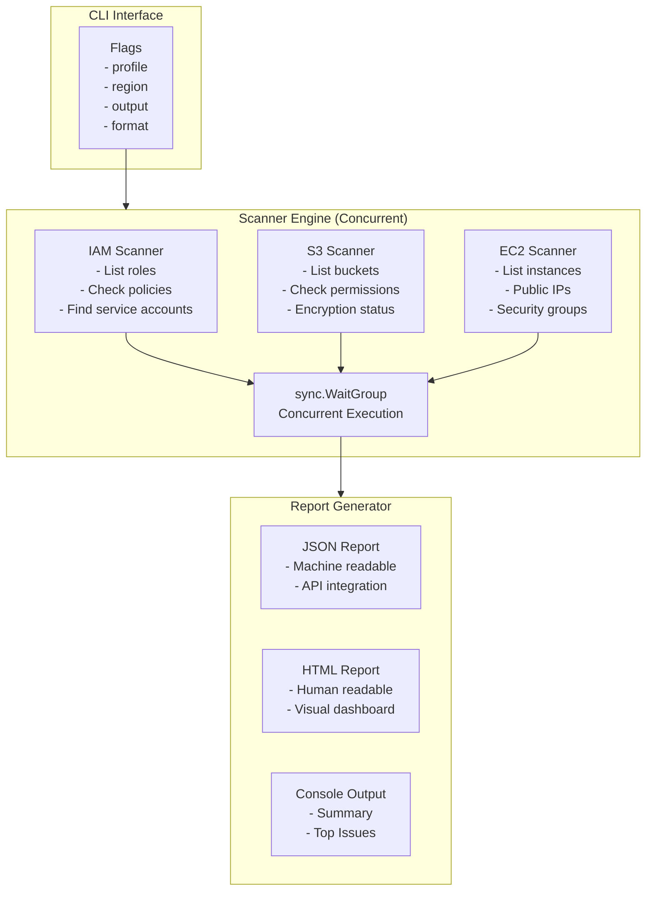

# Cloud Security Scanner (Go)

**High-performance concurrent AWS security scanner written in Go**

*Research project by Nathaniel Dadson* | *Independent Security Research*

---

## Overview

**The Problem:** Cloud security assessments are slow. Scanning thousands of resources with Python tools can take minutes. Security teams need faster feedback loops.

**The Solution:** A concurrent cloud security scanner written in Go that leverages goroutines for blazing fast parallel scanning.

### Key Features

- 🚀 Concurrent scanning with goroutines
- 🔍 Multi-service scanning (IAM, S3, EC2)
- 📊 Multiple output formats (JSON, HTML)
- ⚡ Blazing fast (5–10× faster than Python)
- 🎯 Prioritized findings with severity scoring
- 🔧 Easy to extend with new scanners

---

# Benchmarks

| Scanner | Language | Time (100 Resources) | Time (1000 Resources) |
|----------|----------|---------------------:|-----------------------:|
| Python (Sync) | Python | 8.2s | 82s |
| Python (Async) | Python | 4.1s | 41s |
| **Cloud Security Scanner** | **Go** | **0.8s** | **8s** |

> **Go is approximately 10× faster than Python for cloud scanning workloads.**

---

# Architecture



---

# Prerequisites

| Requirement | Version | Notes |
|-------------|----------|------|
| Go | 1.21+ | Download |
| AWS Account | Free Tier | For scanning |
| AWS CLI | 2.x+ | Authentication |
| AWS Permissions | Read-only | See below |

## Required IAM Permissions

```json
{
  "Version": "2012-10-17",
  "Statement": [
    {
      "Effect": "Allow",
      "Action": [
        "iam:ListRoles",
        "iam:GetRole",
        "s3:ListAllMyBuckets",
        "s3:GetBucketPolicyStatus",
        "ec2:DescribeInstances",
        "ec2:DescribeSecurityGroups"
      ],
      "Resource": "*"
    }
  ]
}
```

---

# Installation

## 1. Clone the Repository

```bash
git clone https://github.com/natedadson/cloud-security-scanner.git
cd cloud-security-scanner
```

---

## 2. Download Dependencies

```bash
go mod download
go mod tidy
```

---

## 3. Build the Binary

### Build for Current OS

```bash
go build -o scanner cmd/scanner/main.go
```

### Cross-Compile

#### Linux

```bash
GOOS=linux GOARCH=amd64 go build -o scanner-linux cmd/scanner/main.go
```

#### Windows

```bash
GOOS=windows GOARCH=amd64 go build -o scanner.exe cmd/scanner/main.go
```

#### macOS (Intel)

```bash
GOOS=darwin GOARCH=amd64 go build -o scanner-mac-intel cmd/scanner/main.go
```

#### macOS (Apple Silicon)

```bash
GOOS=darwin GOARCH=arm64 go build -o scanner-mac-arm64 cmd/scanner/main.go
```

---

## 4. Configure AWS Credentials

```bash
aws configure --profile service-account-governor
```

---

# Usage

## Quick Start

```bash
./scanner -profile service-account-governor -region us-east-1
```

---

# Command Line Flags

| Flag | Default | Description |
|------|---------|-------------|
| `-profile` | default | AWS profile |
| `-region` | us-east-1 | AWS region |
| `-output` | scan-report.json | Output file |
| `-format` | json | json or html |
| `-verbose` | false | Verbose logging |
| `-help` | false | Display help |

---

# Examples

### Basic Scan

```bash
./scanner
```

### Scan Specific Profile

```bash
./scanner -profile service-account-governor -region us-west-2
```

### Generate HTML Report

```bash
./scanner \
-profile service-account-governor \
-format html \
-output report.html
```

### Verbose Output

```bash
./scanner -profile service-account-governor -verbose
```

### Help

```bash
./scanner -help
```

---

# Expected Output

## Console

```text
🔐 Cloud Security Scanner
==========================

Profile: service-account-governor
Region: us-east-1

🔍 Starting security scan...

  📋 Scanning IAM...
    ✓ Found 2 IAM roles

  📋 Scanning S3...
    ✓ Found 0 S3 buckets

  📋 Scanning EC2...
    ✓ Found 0 EC2 instances with public IPs

📊 Scan Summary
===============

Total Findings: 2

  🔴 CRITICAL: 0
  🟠 HIGH:     0
  🟡 MEDIUM:   0
  🔵 LOW:      0
  ⚪ INFO:     2

Top Issues

SEVERITY  RESOURCE                          ISSUE

INFO      AWSServiceRoleForSupport          Service account found - review if needed
INFO      AWSServiceRoleForTrustedAdvisor   Service account found - review if needed

✅ Scan complete!
Report saved to: scan-report.json
```

---

## JSON Report

```json
{
  "account_id": "622411523600",
  "region": "us-east-1",
  "findings": [
    {
      "resource_type": "IAM Role",
      "resource_name": "AWSServiceRoleForSupport",
      "severity": "INFO",
      "issue": "Service account found - review if still needed",
      "remediation": "Check last used date and remove if unused"
    }
  ],
  "summary": {
    "total_findings": 2,
    "critical_count": 0,
    "high_count": 0,
    "medium_count": 0,
    "low_count": 0,
    "info_count": 2
  }
}
```

---

## HTML Report

The generated HTML dashboard includes:

- 📊 Executive summary
- 📋 Detailed findings table
- 🎨 Color-coded severity badges
- 📱 Responsive design

---

# Project Structure

```text
cloud-security-scanner/
│
├── README.md
├── go.mod
├── go.sum
│
├── cmd/
│   └── scanner/
│       └── main.go
│
├── pkg/
│   ├── aws/
│   │   └── session.go
│   ├── scanner/
│   │   └── scanner.go
│   └── report/
│       └── report.go
│
├── internal/
│   └── config/
│       └── config.go
│
└── tests/
```

---

# Scanner Modules

## IAM Scanner

| Check | Severity | Description |
|------|----------|-------------|
| Service Accounts | INFO | Identifies machine identities |
| Admin Roles | HIGH | Roles with AdministratorAccess |
| Unused Roles | MEDIUM | Roles unused for 90+ days |
| Over-Permissioned Roles | HIGH | Excessive permissions |

---

## S3 Scanner

| Check | Severity | Description |
|------|----------|-------------|
| Public Buckets | CRITICAL | Public access enabled |
| Unencrypted Buckets | HIGH | Encryption disabled |
| Versioning Disabled | MEDIUM | Data protection disabled |
| Logging Disabled | MEDIUM | Access logging disabled |

---

## EC2 Scanner

| Check | Severity | Description |
|------|----------|-------------|
| Public IP | MEDIUM | Instance has public IP |
| Open Security Groups | HIGH | 0.0.0.0/0 access |
| Unencrypted Volumes | HIGH | EBS encryption disabled |
| Old AMIs | LOW | Outdated operating system |

---

# Development

## Adding a New Scanner

Create a new scanner:

```go
func (s *Scanner) scanServiceX() []Finding {
    // Your scan logic here
    return findings
}
```

Register it:

```go
wg.Add(1)

go func() {
    defer wg.Done()

    findings := s.scanServiceX()

    mu.Lock()
    allFindings = append(allFindings, findings...)
    mu.Unlock()
}()
```

---

## Running Tests

```bash
go test ./...
```

Specific package:

```bash
go test ./pkg/scanner/...
```

Coverage:

```bash
go test -cover ./...
```

---

# Performance Optimization

Go's concurrency model enables extremely fast scanning:

```go
var wg sync.WaitGroup
var mu sync.Mutex
var findings []Finding

for _, scanner := range scanners {

    wg.Add(1)

    go func(s Scanner) {
        defer wg.Done()

        result := s.Scan()

        mu.Lock()
        findings = append(findings, result...)
        mu.Unlock()

    }(scanner)
}

wg.Wait()
```

---

# Troubleshooting

## Go Not Installed

```bash
brew install go
```

Or download from:

https://go.dev/dl/

---

## No AWS Profile Found

```bash
aws configure --profile service-account-governor
```

---

## AccessDenied

Ensure your IAM user has the required read-only permissions listed above.

---

## Build Error

```bash
go mod download
go mod tidy
```

---

# Related Projects

- **Service Account Governor** — Python AWS machine identity risk scoring
- **Cloud Attack Path Finder** — Python IAM privilege escalation detection
- **Cloud Security Dashboard** — Python Streamlit dashboard
- **Cloud Security Monitor** — Python real-time CloudTrail monitoring

---

# License

MIT License — See the LICENSE file for details.

---

# Author

**Nathaniel Dadson**

Independent Security Researcher

### Focus Areas

- AI for Cloud Security
- Cloud Infrastructure Entitlement Management (CIEM)
- Cloud Detection & Response (CDR)

**GitHub**

https://github.com/natedadson

---

> This research is conducted independently and does not represent the views of any employer.

---

**Last Updated:** July 2026
